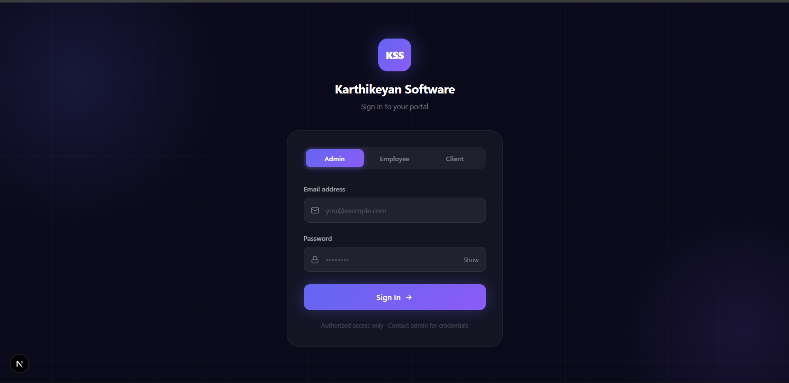
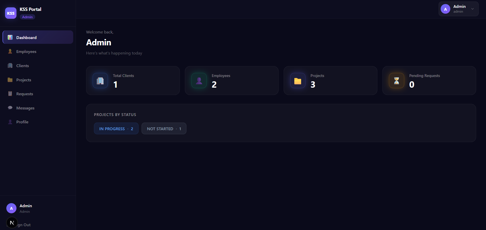
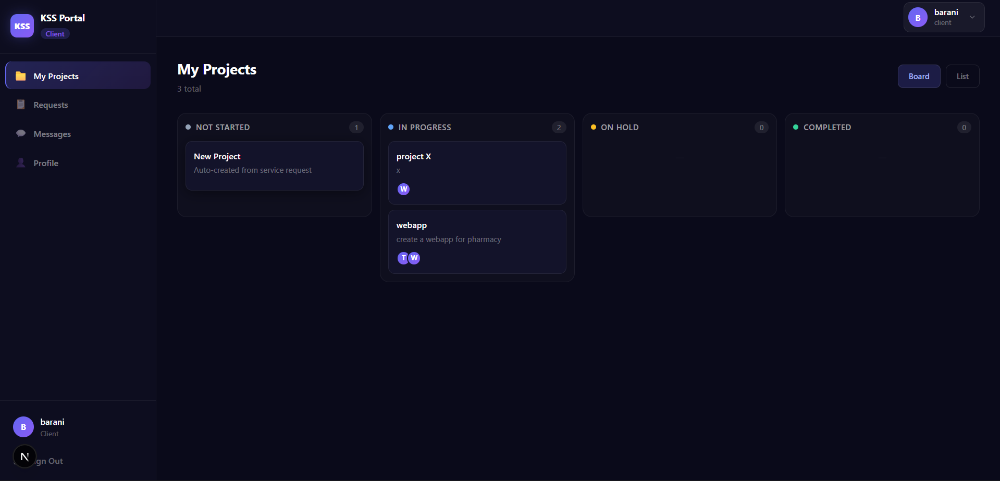
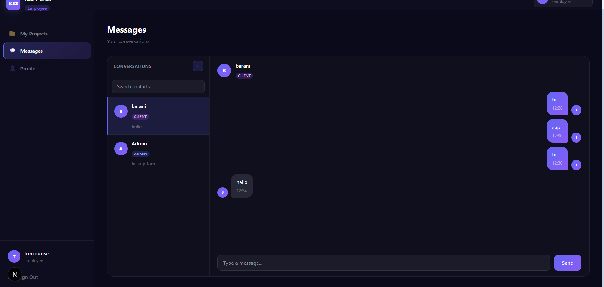

# ClientFlow 🚀

> 🌐 **Live Demo**: [https://client-flow-4iol.vercel.app](https://client-flow-4iol.vercel.app)

> A client portal for software agencies — clients submit requests, admins approve and assign them as projects to employees, with built-in messaging and a Kanban board across all three roles.

---

 🌐 **Live Demo**: [https://client-flow-4iol.vercel.app](https://client-flow-4iol.vercel.app)

---

## Screenshots

| Login | Admin Dashboard |
|-------|----------------|
|  |  |

| client Board | Messaging |
|-------------|-----------|
|  |  |

---

## Tech Stack

| Layer | Technology |
|-------|------------|
| Frontend | Next.js 14 (App Router), TypeScript |
| Backend | Node.js, Express (ESM), Bun |
| Database | MongoDB Atlas, Mongoose |
| Auth | JWT — role-based (Admin, Employee, Client) |
| Email | Nodemailer + Gmail SMTP App Password |

---

## Features

- 🔐 Role-based JWT auth (Admin / Employee / Client)
- 📋 Client submits requests → Admin approves → Project auto-created
- 📁 Kanban board with 4 columns (Not Started, In Progress, On Hold, Completed)
- 💬 In-app messaging with contact search
- 👤 Profile management for all three roles
- ✅ Employee can update project status

---

## Setup Instructions

### Prerequisites
- [Bun](https://bun.sh) installed
- Node.js v18+
- MongoDB Atlas account
- Gmail
  
### 1. Clone the repo
```bash
git clone https://github.com/karthikeyan18v/ClientFlow.git
cd ClientFlow
```

### 2. Backend
```bash
cd backend
bun install
```

Create `backend/.env`:
```env
PORT=5000
MONGO_URI=your_mongodb_connection_string
JWT_SECRET=your_jwt_secret
SMTP_EMAIL=your_gmail@gmail.com
SMTP_APP_PASSWORD=your_gmail_app_password
```

Seed admin account, then start:
```bash
bun run src/seedAdmin.js
bun run src/server.js
```

### 3. Frontend
```bash
cd frontend
npm install
npm run dev
```

| Service | URL |
|---------|-----|
| Frontend | http://localhost:3000 |
| Backend | http://localhost:5000 |

---

## Database Setup

1. Create a free cluster at [mongodb.com/atlas](https://www.mongodb.com/atlas)
2. Whitelist your IP → create a DB user → copy the connection string into `MONGO_URI`
3. Collections auto-created by Mongoose on first run:

| Collection | Purpose |
|------------|---------|
| `users` | Admin, Employee, Client accounts |
| `projects` | Projects with status & assignments |
| `servicerequests` | Client requests (title + description) |
| `messages` | Chat messages between users |

---

## Test Login Credentials

> Create Employee and Client accounts from the Admin panel after seeding.

| Role | Email | Password |
|------|-------|----------|
| Admin | admin@test.com  | Admin123 |
| Employee | karthikeyan18v@gmail.com | 123456 |
| Client | tbarani0723@gmail.com | 123456 |

---

## Project Structure

```
ClientFlow/
├── backend/
│   ├── src/
│   │   ├── controllers/   # admin, employee, client, auth, message
│   │   ├── models/        # User, Project, ServiceRequest, Message
│   │   ├── routes/        # role-based route files
│   │   ├── middleware/    # JWT auth, role guard
│   │   └── utils/         # jwt, mailer
│   └── .env               # not committed
└── frontend/
    ├── app/
    │   ├── admin/         # dashboard, projects, requests, employees, clients
    │   ├── employee/      # projects, messages, profile
    │   └── client/        # requests, projects, messages, profile
    ├── components/        # Sidebar, Header, MessagesView, ConfirmDialog
    └── lib/               # api.ts, auth.ts
```

---


